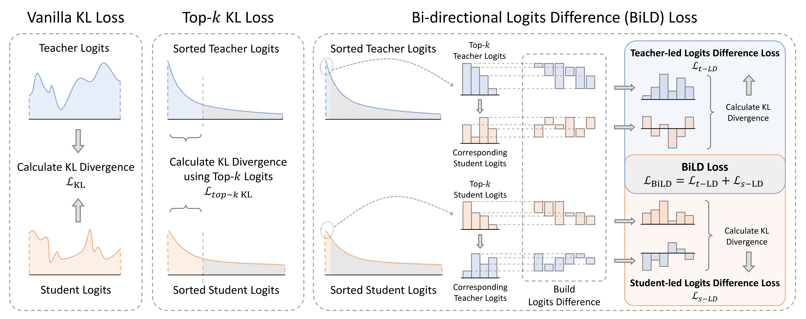

# [COLING2025] BiLD: Bi-directional Logits Difference Loss for Large Language Model Distillation[[paper](https://arxiv.org/pdf/2406.13555)]

<div align="center">

</div>

## 1. Environment

```bash
pip install -r requirements.txt
```


## 2. Data

```bash
bash scripts/prepare_dataset.sh
```

The processed data will be organized in this structure:

```bash
./benchmarking
├── datasets
│   ├── arc-c
│   ├── arc-e
│   ├── boolq
│   ├── cb
│   ├── copa
│   ├── hellaswag
│   ├── multirc
│   ├── piqa
│   ├── record
│   ├── rte
│   ├── wic
│   ├── winogrande
│   └── wsc
├── evaluation.py
├── __init__.py
└── reformat_data.py
```

## 3. Experiments

Note that all these scripts are running with evaluation.

### 3.1 SFT teacher
```bash
bash scripts/sft/sft_qwen_4b.sh <YOUR_QWEN_4B_PATH>
bash scripts/sft/sft_bloom_7b.sh <YOUR_BLOOM_7B_PATH>
```

### 3.2 Build SFT baselines
```bash
bash scripts/sft/sft_qwen_1.8b.sh <YOUR_QWEN_1.8B_PATH>
bash scripts/sft/sft_qwen_0.5b.sh <YOUR_QWEN_0.5B_PATH>
bash scripts/sft/sft_bloom_3b.sh <YOUR_BLOOM_3B_PATH>
bash scripts/sft/sft_bloom_1b.sh <YOUR_BLOOM_1B_PATH>
```


### 3.3 Distillation
We take the distillation experiments from Qwen1.5-4b to Qwen1.5-0.5b as an example. Run these commands:

```bash
bash scripts/distillation/distil_qwen_4b_to_0.5b.sh vanilla_kl
bash scripts/distillation/distil_qwen_4b_to_0.5b.sh top_kl
bash scripts/distillation/distil_qwen_4b_to_0.5b.sh rkl
bash scripts/distillation/distil_qwen_4b_to_0.5b.sh dkd
bash scripts/distillation/distil_qwen_4b_to_0.5b.sh nkd
bash scripts/distillation/distil_qwen_4b_to_0.5b.sh normkd
bash scripts/distillation/distil_qwen_4b_to_0.5b.sh bild
```

### 3.4 Results Organization

The results are organized as below in default:

```bash
./results
├── distillation
│   ├── bloom_7b_to_1b
│   │   ├── bild
│   │   ├── dkd
│   │   ├── nkd
│   │   ├── normkd
│   │   ├── rkl
│   │   ├── top_kl
│   │   └── vanilla_kl
│   ├── bloom_7b_to_3b
│   │   └── ...
│   ├── qwen_4b_to_0.5b
│   │   └── ...
│   └── qwen_4b_to_1.8b
│       └── ...
├── sft_baseline
│   ├── bloom_1b
│   ├── bloom_3b
│   ├── qwen_0.5b
│   └── qwen_1.8b
└── teacher
    ├── bloom_7b
    └── qwen_4b
```

## 4. Analysis Overlap

We seperate this step into two sub-steps to avoid GPUs out of memory.

Save teacher logits:
```bash
bash scripts/analyze_overlap/save_teacher_logits.sh qwen <PATH_TO_YOUR_QWEN_4B_SFT_LAST_CHECKPOINT> ./results/teacher_logits/
bash scripts/analyze_overlap/save_teacher_logits.sh bloom <PATH_TO_YOUR_BLOOM_7B_SFT_LAST_CHECKPOINT> ./results/teacher_logits/
```

Calculate overlap.
Example: calculate ${\rm overlap}@32$ of BiLD loss in distillation from Qwen1.5-4b to Qwen1.5-0.5b:
```bash
bash scripts/analyze_overlap/calc_top_acc_overlap.sh qwen 32 ./results/distillation/qwen_4b_to_0.5b/bild ./results/teacher_logits
```
